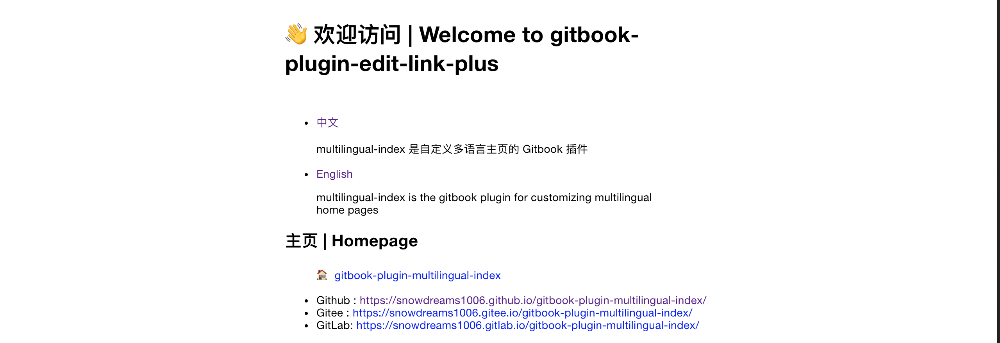

# 欢迎访问 gitbook-plugin-multilingual-index 官网 👋

[](https://www.npmjs.com/package/gitbook-plugin-multilingual-index)
[](https://www.npmjs.com/package/gitbook-plugin-multilingual-index)
[](https://www.npmjs.com/package/gitbook-plugin-multilingual-index)
[](https://github.com/snowdreams1006/gitbook-plugin-multilingual-index#readme)
[](https://github.com/snowdreams1006/gitbook-plugin-multilingual-index/graphs/commit-activity)
[](https://github.com/snowdreams1006/gitbook-plugin-multilingual-index/blob/master/LICENSE)
[](https://github.com/snowdreams1006)
[](https://snowdreams1006.tech/)
[](https://snowdreams1006.github.io/snowdreams1006-wechat-public.jpeg)

> 自定义多语言主页

[中文](./README_zh.md) | [English](./README.md)

### 🏠 [主页](https://github.com/snowdreams1006/gitbook-plugin-multilingual-index#readme)

- Github : [https://snowdreams1006.github.io/gitbook-plugin-multilingual-index/](https://snowdreams1006.github.io/gitbook-plugin-multilingual-index/)
- GitLab : [https://snowdreams1006.gitlab.io/gitbook-plugin-multilingual-index/](https://snowdreams1006.gitlab.io/gitbook-plugin-multilingual-index/)
- Gitee : [https://snowdreams1006.gitee.io/gitbook-plugin-multilingual-index/](https://snowdreams1006.gitee.io/gitbook-plugin-multilingual-index/)

## 屏幕截图



## 用法

### 步骤＃1 - 更新 `book.json` 文件

1. 在您的gitbook的 `book.json` 文件中，将 `multilingual-index` 添加到 `plugins` 列表中。
2. 在 `pluginsConfig` ，将 `enableSuper` 设置为 `false` 可禁用默认主页，并添加 `index`值以自定义多语言主页。仅支持相对路径。

这是最简单的示例：

```json
{
    "plugins": ["multilingual-index"],
    "pluginsConfig": {
        "multilingual-index": {
            "enableSuper": false,
            "index":"index.html"
        }
    }
}
```

有关更多详细信息，请参考以下配置项：

```json
"enableSuper": {
  "type": "boolean",
  "title": "inherit from super",
  "required": false,
  "default": true
},
"index": {
  "type": "string",
  "title": "default index path",
  "required": false
}
```

### 步骤＃2 - gitbook命令

1. 运行 `gitbook install` 。它将自动为您的 Gitbook 安装 `multilingual-index` gitbook 插件。仅需要一次。

```bash
gitbook install
```

或者您可以运行 `npm install gitbook-plugin-multilingual-index` 来本地安装。

```bash
npm install gitbook-plugin-multilingual-index
```

1. 像往常一样构建您的书（ `gitbook build` ）或服务（ `gitbook serve` ）。

```bash
gitbook serve
```

## 示例

- 官方文档配置文件

> [https://github.com/snowdreams1006/gitbook-plugin-multilingual-index/blob/master/docs/book.json](https://github.com/snowdreams1006/gitbook-plugin-multilingual-index/blob/master/docs/book.json)

```json
{
    "plugins": ["multilingual-index"],
    "pluginsConfig": {
        "multilingual-index": {
            "enableSuper": false,
            "index":"index.html"
        }
    }
}
```


- 官方示例配置文件

> [https://github.com/snowdreams1006/gitbook-plugin-multilingual-index/blob/master/example/book.json](https://github.com/snowdreams1006/gitbook-plugin-multilingual-index/blob/master/example/book.json)

```json
{
    "plugins": ["multilingual-index"],
    "pluginsConfig": {
        "multilingual-index": {
            "enableSuper": true,
            "index":"index.html"
        }
    }
}
```


### 继承默认主页的示例 `book.json` 文件

```json
{
   "plugins": ["multilingual-index"],
    "pluginsConfig": {
        "multilingual-index": {
            "enableSuper": true,
            "index":"index.html"
        }
    }
}
```

### 不继承默认主页的示例 `book.json` 文件

```json
{
    "plugins": ["multilingual-index"],
    "pluginsConfig": {
        "multilingual-index": {
            "enableSuper": false,
            "index":"index.html"
        }
    }
}
```

## 作者

👤 **snowdreams1006**

- 网站： [snowdreams1006.tech](https://snowdreams1006.tech/)
- [GitHub](https://github.com/snowdreams1006) ： [@ snowdreams1006](https://github.com/snowdreams1006)
- 电子邮件： [snowdreams1006@163.com](mailto:snowdreams1006@163.com)

## 贡献

欢迎提供文稿，问题和功能请求！

随时检查[问题页面](https://github.com/snowdreams1006/gitbook-plugin-multilingual-index/issues) 。

## 表示支持

如果这个项目对您有帮助，请给个**[星星](https://github.com/snowdreams1006/gitbook-plugin-multilingual-index)** ！

## 版权

版权所有©2019 [snowdreams1006](https://github.com/snowdreams1006) 。

该项目是[MIT](https://github.com/snowdreams1006/gitbook-plugin-multilingual-index/blob/master/LICENSE)许可的。
